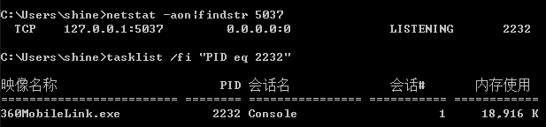

## Window下安装React Native ##

目的：Window 7 旗舰版下使用WebStorm开发NeactNative

### 1、安装Nodo.js（自带npm）###

安装的是node-v6.9.2-x64。并配置npm镜像

	$ npm config set registry https://registry.npm.taobao.org
	$ npm config set disturl https://npm.taobao.org/dist

### 2、安装Git for Windows

我的版本是Git-2.7.2-32-bit_setup.1457942412.exe
在安装过程中，请务必记得勾选:
`Use Git from the Windows Command Prompt`
`Use Windows's default console window`
这样会把Git的可执行程序加入到PATH环境变量中，这样其他程序才能在命令行中正确调用Git。

> 测试是否安装成功：

	$ git --version

### 3、安装Python ###

从官网下载并安装python 2.7.x
我的版本是python-2.7.12.amd64.msi

### 4、安装Yarn、React Native的命令行工具（react-native-cli）###

Yarn是Facebook提供的替代npm的工具，可以加速node模块的下载。React Native的命令行工具用于执行创建、初始化、更新项目、运行打包服务（packager）等任务。

	$ npm install -g yarn

安装react-native-cli建议先去github打包下载来安装，假如你不着急可直接执行命令：

	$ npm install -g react-native-cli

**以下是下载安装:**

先打开[react-native](https://github.com/facebook/react-native)的github网页，选择打包下载（最好用迅雷下载）,然后解压并执行命令：

	$ cd react-native-master/react-native-cli/
	$ npm install -g react-native-cli

### 5、安装Java环境

编译node.js的C++模块时需要用到。
可以先根据命令`java -version`来检测一下。

如果不符合就去[官网下载](http://www.oracle.com/technetwork/java/javase/downloads/jdk8-downloads-2133151.html)并安装：

我安装的是：jdk-8u112-windows-x64.exe

>重要设置系统变量：

	JAVA_HOME = C:\Program Files\Java\jdk1.8.0_112;
	classpath = %JAVA_HOME%\lib\tools.jar;
	path = ...;%JAVA_HOME%\lib;

> 测试是否安装成功：

	$ java -version

### 6、安装Android Studio及SDK

开启Gradle Daemon可以极大地提升java代码的增量编译速度。
 
	(if not exist "%USERPROFILE%/.gradle" mkdir "%USERPROFILE%/.gradle") && (echo org.gradle.daemon=true >> "%USERPROFILE%/.gradle/gradle.properties")

React Native目前需要[Android Studio](developer.android.com/sdk/index.html)2.0或更高版本。

>除非特别注明，请不要改动安装过程中的选项。比如Android Studio默认安装了 Android Support Repository，而这也是React Native必须的（否则在react-native run-android时会报appcompat-v7包找不到的错误）。

- 确定所有安装都勾选了，尤其是`Android SDK`和`Android Device Emulator`。

- 选择`Setup Proxy`设置一下代理，方便安装插件。

- 配置Android SDK Manager的Proxy Settings
 
	HTTP Proxy Server = android-mirror.bugly.qq.com

	HTTP Proxy Port = 8080

请务必选择: `Force https://... sources to be fetched using http://...`

- 选择`Custom`安装。

- 正经来说这里可以选择选择（而且要全部选择），但我这里不能操作，都已经默认安装（installed），直接下一步。并按两次`finish`按钮。

- 点击`Configure`选择`SDK Manager`

- 因为我们要安装`Android SDK Build-Tools 23.0.1`（必须是这个版本），但这里没有。所以我们点击`Launch Standalone SDK Manager`
在SDK Tools窗口中勾选 `Android SDK Build-Tools 23.0.1`

- 在Android 6.0(API 23)下勾选 `SDK Platform` `Intel x86 Atom_64 System Image` `Intel x86 Atom System Image` `Google APIs Intel x86 Atom_64 System Image`以及 `Google APIs`。

- 确定(Install)安装。此时会耗时比较久。

安装好后就可以看到`Android 6.0(Marshmallow)`。

将Android SDK的Tools目录添加到PATH变量中,打开控制面板 -> 系统和安全 -> 系统 -> 高级系统设置 -> 高级 -> 环境变量 -> 新建:

	ANDROID_HOME=C:\Users\shine\AppData\Local\Android\Sdk

> 测试是否安装成功：

	echo %ANDROID_HOME%

将Android SDK的Tools目录添加到PATH变量中,打开控制面板 -> 系统和安全 -> 系统 -> 高级系统设置 -> 高级 -> 环境变量 -> 选中PATH -> 双击进行添加：

	PATH = ....;C:\Users\shine\AppData\Local\Android\Sdk\tools;C:\Users\shine\AppData\Local\Android\Sdk\platform-tools;

> 测试是否安装成功：

	echo %path%

### 7、安装Genymotion（可选，但建议安装）###

> 假如你决定一直使用真机测试就飘过...

#### 前提先安装VirtualBox软件

我安装的是：VirtualBox-5.1.10-112026-Win.exe

然后去https://www.genymotion.com/先注册并登录，然后下载和安装Genymotion安装（注册身份为个人开发者）

然后启动Genymotion,选择添加模拟器并登录帐号。然后选择你要安装的安卓模拟器，主要是选择屏幕大小。文件比较大请耐心等待！

#### 给Android Studio安装插件 ####

选择菜单：File > Settings > Browse repositories... > 搜索genymotion关键字，选择并安装。然后重启Android Studio就可以看到插件了。

点击`Genymotion Device Manager`图标，并设置软件安装目录即可。

再次点击`Genymotion Device Manager`图标，接着安装模拟器点击`New...`然后会启动Genymotion来安装。然后选择一个手机并点击`Start...`即可。但只能有一个模拟器处理`On`状态。

> 重要提示：必须从插件里打开安装模拟器，否则会用不了。同样开启模拟器也必须从`Android Studio`插件里打开`genymotion`。因为只有这样模拟器才会自动获取IP和端口。

### 8、测试安装###

ReactNative项目名称规范是首字母大写，执行npm命令并进入项目文件夹下。

	$ react-native init AwesomeProject
	$ cd AwesomeProject
	$ react-native run-android

>第一次执行此命令需要下载比较多的模块，请耐心等待。

执行之前把真机或者模拟器启用。有个常见的问题是在你运行`react-native run-android`命令后，Packager可能不会自动运行。此时你可以手动启动它，另开启一个npm命令窗口执行：

	cd AwesomeProject
	react-native start

执行后可输入网址查看打包情况：http://localhost:8081/index.android.bundle?platform=android

查看并debug界面：http://localhost:8081/debugger-ui

在你已经成功运行了项目，我们可以开始尝试动手改一改了，按两下R键，或是用Menu键（通常是F2，在Genymotion模拟器中是⌘+M）打开开发者菜单，然后选择 Reload JS 就可以看到你的最新修改。

扩展阅读：[http://reactnative.cn/docs/0.39/getting-started.html](http://reactnative.cn/docs/0.39/getting-started.html)

恭喜完成安装！
-

## 问题解决 ##

**Q：** build成功后真机测试是红色，提示没有连接服务器js Server

**A：** 最简单办法是执行cmd命令：

	adb reverse tcp:8081 tcp:8081

>或者我们摇一摇手机，点击Dev Settings后，点击Debug server host & port for device,设置IP和端口。这里的IP是电脑的IP，不知道的可以在命令行中输入ipconfig进行查询，端口号固定8081
例如：192.168.1.103:8081

**Q:** 运行react-native run-android时报错，报错信息中含有`Could not find tools.jar`等字样

**A：** 请留意上面设置系统变量classpath，path和JAVA_HOME。

**Q：** 出现`com.android.builder.testing.api.DeviceException: Timeout getting device list.`字样错误怎么办？

**A：** 只要是模拟器问题，先考虑从`Android Studio`模拟器插件里，删除模拟器后重新安装一个（重新安装很快的）。

**Q：** 出现`cannot bind to 127.0.0.1:5037`字样错误怎么办？

**A：** 一般是5037端口被占用。想办法关闭进程。或者让相关程序不要随机启动。

比如360手机助力就无法杀进程。

[参阅更多问题解决方法](http://bbs.reactnative.cn/topic/130/%E6%96%B0%E6%89%8B%E6%8F%90%E9%97%AE%E5%89%8D%E5%85%88%E6%9D%A5%E8%BF%99%E9%87%8C%E7%9C%8B%E7%9C%8B-react-native%E7%9A%84%E5%B8%B8%E8%A7%81%E9%97%AE%E9%A2%98)

## Android安装包制作签名 ##

Android SDK 1.6 最主要改变为模拟器或真机可用系统自动创建的调试签名证书(debug.keystore), 但可发布的安装程序必须要先创建自签名证书 包括密钥库 keystore 和私钥 key alias。

- 1、生成一个签名密钥

	`keytool -genkey -v -keystore xxx-release-key.keystore -alias xxx-alias -keyalg RSA -keysize 2048 -validity 1000`

其中`xxx-release-key.keystore`和`xxx-alias`根据自己需要修改。
回车后回答以下问题：

    Enter keystore password:            <-- 设置keystore密码-必须至少6个字符
    What is your first and last name?
      [Unknown]:                        <-- 输入你的名字
    What is the name of your organizational unit?
      [Unknown]:                        <-- 组织单位, 可以忽略
    What is the name of your organization?
      [Unknown]:                        <-- 组织, 可以忽略
    What is the name of your City or Locality?
      [Unknown]:                        <-- 城市
    What is the name of your State or Province?
      [Unknown]:                        <-- 省份
    What is the two-letter country code for this unit?
      [Unknown]: CN                     <-- 国家
    Is CN=ipod4g, OU=Unknown, O=Unknown, L=Unknown, ST=Unknown, C=CN correct?
      [no]:  yes                        <-- 输入 yes 确认

    Generating 1,024 bit RSA key pair and self-signed certificate (SHA1withRSA) with a validity of 10,000 days
        for: CN=ipod4g, OU=Unknown, O=Unknown, L=Unknown, ST=Unknown, C=CN
    Enter key password for           
        (RETURN if same as keystore password):    <-- 设置key密码，如与keystore密码相同，回车
    [Storing android-release-key.keystore]

keystore密码和key密码我们暂定`shine2017`。然后它会生成一个叫`xxx-release-key.keystore`的密钥库文件。

- 2、下载bundle文件

>前提是需要curl.exe文件，如果没有去[curl网站](https://curl.haxx.se/download.html)上按视系统情况下载，并放到C:\Windows\System32下。测试是否安装命名：`curl -V`

进入项目里的路径`/android\app\src\main`，并在该目录下新建assets文件夹。

然后使用npm命令进入项目目录执行命令：

	curl -k "http://localhost:8081/index.android.bundle" > android/app/src/main/assets/index.android.bundle

- 3、添加gradle的android keystore配置

在android/build.gradle文件的defaultConfig{}配置下添加：

	signingConfigs {
		release{
			storeFile file("D://scscms/ReactNative/HelloText/android/xxx-release-key.keystore")
			storePassword "shine2017"
			keyAlias "xxx-alias"
			keyPassword "shine2017"
		}
	}

	buildTypes {
		release {
			minifyEnabled false
			proguardFiles getDefaultProguardFile('proguard-android.txt'),'proguard-rules.pro'
			signingConfig signingConfigs.release   //引用签名配置（见上面）
		}
	}

- 4、启用proguard代码混淆

打开android/app/build.gradle文件配置:
	
	def enableProguardInReleaseBuilds = true

重要：启用Proguard之后，必须再次全面测试应用。

- 5、执行gradle打包

>前提需要安装gradle工具(版本与android\gradle\wrapper\gradle-wrapper.properties下的distributionUrl一致)，下载解压好后还需要设置环境变量，在path环境变量中添加`D:\Program Files\gradle-2.4\bin`。最后可运行`gradle -v`检查是否安装成功。

在/android/目录中执行命令:

	$ aradle assembleRelease

打包后的文件在android/app/build/outputs/apk目录中，例如app-release.apk。如果打包遇到问题可以先执行`gradle clean`命令清理一下。
最后向老板报告：任务完成，去各市场发布APP去吧！

### Webstrom 代码智能提醒 （可选）###

ReactNative 代码智能提醒 （Webstrom live template）

	git clone https://github.com/virtoolswebplayer/ReactNative-LiveTemplate

**window下安装：**

> 选择菜单 file -> import settings -> ReactNative.jar

**Mac下安装：**

将ReactNative.xml复制到 ~/Library/Preferences/WebStorm11/templates 然后重启 WebStrom。

### React学习 ###

初学者难理解ReactNative的话，可先了解下[React](https://facebook.github.io/react/docs/installation.html)。